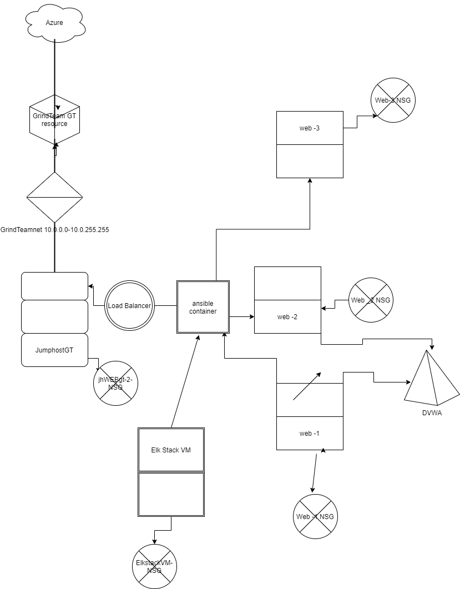
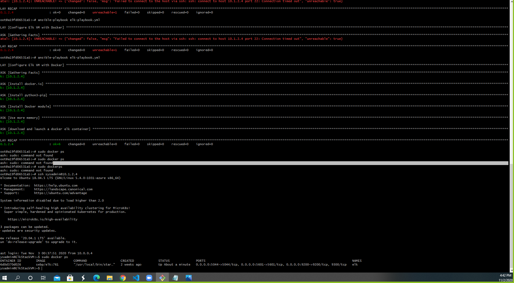

## Automated ELK Stack Deployment

The files in this repository were used to configure the network depicted below.

These files have been tested and used to generate a live ELK deployment on Azure. They can be used to either recreate the entire deployment pictured above. Alternatively, select portions of the _____ file may be used to install only certain pieces of it, such as Filebeat.

  - : elk-playbook.yml

This document contains the following details:
- Description of the Topologu
- Access Policies
- ELK Configuration
  - Beats in Use
  - Machines Being Monitored
- How to Use the Ansible Build

### Description of the Topology

The main purpose of this network is to expose a load-balanced and monitored instance of DVWA, the D*mn Vulnerable Web Application.

Load balancing ensures that the application will be highly available, in addition to restricting DoS DoS attacks to the network.
- :   What aspect of security do load balancers protect?DDoS What is the advantage of a jump box? You can run your apps instantly_

Integrating an ELK server allows users to easily monitor the vulnerable VMs for changes to the logs and system traffic.
- : What does Filebeat watch for? Filebeat watches for information in files that has been changed
- : What does Metricbeat record? Metricbeats records metrics and statistics and ships them to specified outputs

The configuration details of each machine may be found below.
_Note: Use the [Markdown Table Generato](http://www.tablesgenerator.com/markdown_tables) to add/remove values from the table_.

| Name     | Function | IP Address | Operating System |
|----------|----------|------------|------------------|
| JumpHostGT | Gateway  | 10.0.0.4   | Linux            |
| Web-1    |           |  10.0.0.7          | Linux                 |
| Web-2     |          | 10.0.0.8           | Linux                  |
| Web-3     |          | 10.0.0.9           | Linux                  |

### Access Policies

The machines on the internal network are not exposed to the public Internet. 

Only the JumpHostGT machine can accept connections from the Internet. Access to this machine is only allowed from the following IP addresses: 
- : 207.46.13.93

Machines within the network can only be accessed by private ip addresses.
- : Which machine did you allow to access your ELK VM? Only accessed by going through the ansible container.  What was its IP address? 10.1.2.4

A summary of the access policies in place can be found in the table below.

| Name     | Publicly Accessible | Allowed IP Addresses |
|----------|---------------------|----------------------|
| Jump Box | Yes            | 10.0.0.1 10.0.0.2    |
|          |                     |                      |
|          |                     |                      |

### Elk Configuration

Ansible was used to automate configuration of the ELK machine. No configuration was performed manually, which is advantageous because...
- : What is the main advantage of automating configuration with Ansible? No special coding skills are necessary. Another advantage is it eliminates mistakes and will work the same each time. 

The playbook implements the following tasks:
- _ In 3-5 bullets, explain the steps of the ELK installation play. E.g., install Docker; download image; etc._
- * it uses apt to install docker.io    
  * Uses apt again to install python 3
  * uses pip to in stall docker module
  * uses command module to increase virtual memory
  * uses sysctl to use more memory
- ...

The following screenshot displays the result of running `docker ps` after successfully configuring the ELK instance.

### Target Machines & Beats
This ELK server is configured to monitor the following machines:
- _: List the IP addresses of the machines you are monitoring_
10.0.0.7
10.0.0.8
10.0.0.9

We have installed the following Beats on these machines:
- _: Specify which Beats you successfully installed_ 
I installed metricbeat and filebeat

These Beats allow us to collect the following information from each machine:
- : In 1-2 sentences, explain what kind of data each beat collects, and provide 1 example of what you expect to see. E.g., `Winlogbeat` collects Windows logs, which we use to track user logon events, etc._
Filebeat collects log events and forwards them to Elasticsearch for indexing. The Filebeat logs are kept at /var/log/filebeat/filebeat.
Metricbeat collect metrics from the operating system and from services running on server. Metricbeat takes these metrics and statistics and 
sends them to Elasticsearch.
### Using the Playbook
In order to use the playbook, you will need to have an Ansible control node already configured. Assuming you have such a control node provisioned: 

SSH into the control node and follow the steps below:
- Copy the filebeat playbook file  file to filebeat-playbook.yml.
- Update the filebeat-playbook.yml file to include... my Elk-StackVM private ip number 10.1.2.4
- Run the playbook, and navigate to DVWA to check that the installation worked as expected.

: Answer the following questions to fill in the blanks:  
- _Which file is the playbook? Where do you copy it? The file is called filebeat-playbook.yml. The file is copied into /etc/ansible/roles directorycd ../

- _Which file do you update to make Ansible run the playbook on a specific machine? You have to update the elk-playbook.yml                                                            How do I specify which machine to install the ELK server on versus which to install Filebeat on? The filebeat is installed on webservers and the elk is installed on on the elk 

_As a **Bonus**, provide the specific commands the user will need to run to download the playbook, update the files, etc._ansible-playbook metricbeat-playbook.yml,  ansible-playbook filebeat-playbook.yml, nano elk-playbook.yml
